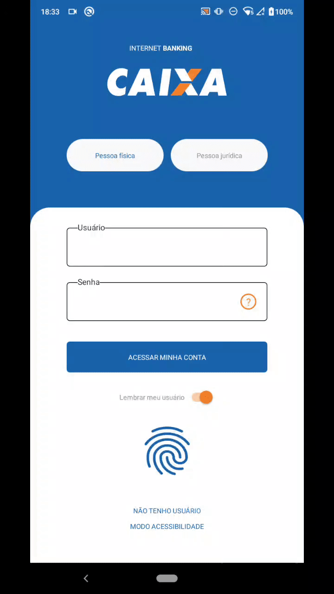
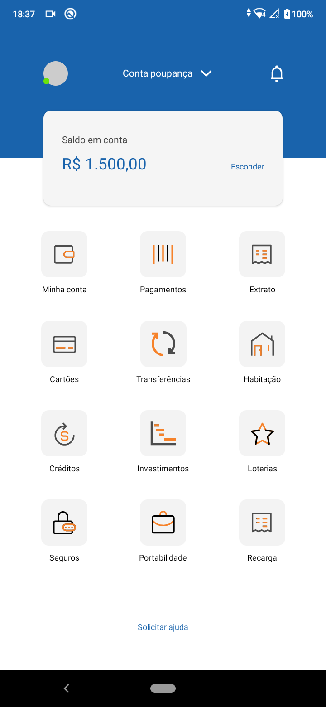

<h1 align="center">
	Caixa Econômica - Proposta de Layout
</h1>

<p align="center">
  

  

  <a href="https://www.linkedin.com/in/lucasdeveloperti/">
    
  </a>

  <a href="https://github.com/lucas-eduardo/layout-caixa/commits/master">
    
  </a>

  

   <a href="https://github.com/lucas-eduardo/layout-caixa/stargazers">
    
  </a>
</p>

## 💻 Sobre o projeto

O projeto foi desenvolvido para fins de estudo, seguindo o layout criado por <strong>[Vinicius Rodrigues](vinicius)</strong>.

Layout: https://dribbble.com/vinidsgn

---

## 🛠 Principais ferramentas

As principais ferramentas foram usadas na construção do projeto:

- [React Native][reactnative]
- [TypeScript][typescript]
- [Styled Components][styled-components]

## 🎨 Imagens
<p align="center">
  

  

  
</p>

### 🧭 Rodando a aplicação

```bash
# Clone este repositório
$ git clone https://github.com/lucas-eduardo/layout-caixa

# Acesse a pasta do projeto no seu terminal/cmd
$ cd layout-caixa

# Instale as dependências
$ yarn install

# Execute a aplicação em modo de desenvolvimento
$ yarn start

# Em outro terminal, fazer a instalação no android
$ yarn android
```

[vinicius]: https://www.linkedin.com/in/viniciusdsgn/
[typescript]: https://www.typescriptlang.org/
[reactnative]: https://reactnative.dev/
[styled-components]: https://styled-components.com/
